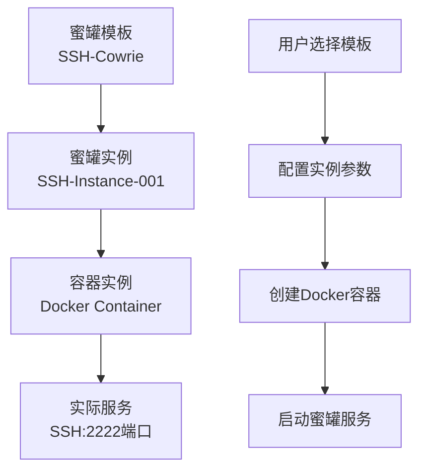
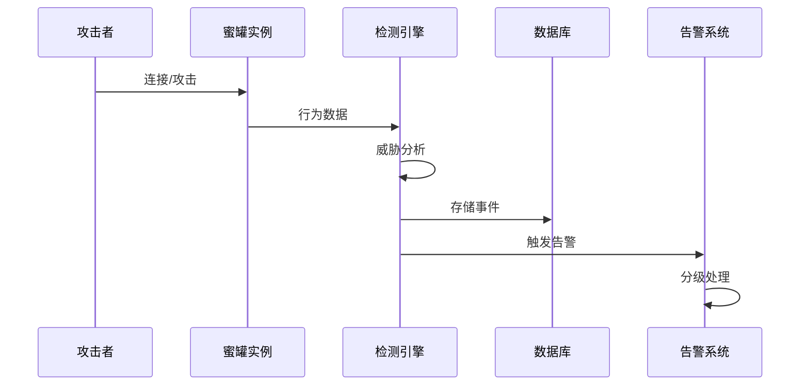

# Andorralee 边缘蜜罐系统架构说明

## 📋 甲方需求明确

根据甲方反馈，**Andorralee 应该是一个边缘蜜罐、动态蜜罐系统**，需要具备：
1. **危险告警能力** ✅ 已实现
2. **威胁分级能力** ✅ 已实现  
3. **蜜罐与实例的清晰关系** 📋 下面详细说明

---

## 🏗️ 蜜罐与实例的关系架构

### 核心概念理解

#### 1. 蜜罐模板 (HoneypotTemplate)
- **作用**: 蜜罐的"设计图纸"
- **包含内容**: 协议类型、Docker镜像、端口配置、环境变量
- **比喻**: 就像房屋设计图，定义了蜜罐应该如何构建

#### 2. 蜜罐实例 (HoneypotInstance) 
- **作用**: 根据模板创建的具体蜜罐服务
- **包含内容**: 具体的配置参数、运行状态、部署信息
- **比喻**: 根据设计图实际建造的房屋

#### 3. 容器实例 (ContainerInstance)
- **作用**: 蜜罐实例的"载体"，Docker容器
- **包含内容**: 容器ID、网络配置、端口映射、资源限制
- **比喻**: 房屋的地基和框架结构

### 部署关系链



**简单说明**: 
- **蜜罐部署在实例里面** ✅ 正确理解
- 容器实例是蜜罐实例的运行环境
- 一个蜜罐实例对应一个容器实例
- 容器实例提供网络隔离和资源管理

---

## 🛡️ 边缘蜜罐特性

### 1. 动态部署能力 ✅ 已实现

#### 支持的蜜罐类型:
```go
// 系统预置模板
SSH蜜罐 (Cowrie)    - 端口 22/2222
HTTP蜜罐 (Dionaea)  - 端口 80/8080
FTP蜜罐 (Dionaea)   - 端口 21/2121
Telnet蜜罐 (Cowrie) - 端口 23/2323
```

#### 动态特性:
- ✅ **端口动态分配**: 10000-19999端口池
- ✅ **容器化隔离**: 每个蜜罐独立Docker容器
- ✅ **快速部署**: API驱动的自动化部署
- ✅ **状态管理**: created → running → stopped

### 2. 边缘计算适配 ✅ 已实现

#### 边缘特性:
- ✅ **轻量化部署**: Docker容器化，资源占用小
- ✅ **无人值守**: 自动化管理，无需人工干预
- ✅ **实时处理**: 边缘侧攻击检测和响应
- ✅ **数据本地化**: 本地数据库存储，减少网络传输

---

## ⚠️ 危险告警系统

### 1. 病毒检测告警 ✅ 已实现

#### 威胁分级标准:
```go
威胁等级映射:
- Clean: 0    (无威胁)
- Low: 1      (低威胁) 
- Medium: 2   (中等威胁)
- High: 3     (高威胁)
- Critical: 4 (严重威胁)
```

#### 告警触发机制:
- ✅ **文件上传检测**: 实时扫描上传文件
- ✅ **哈希特征匹配**: 基于病毒特征库
- ✅ **自动评级**: 根据检测结果自动分级
- ✅ **数据库记录**: 持久化存储告警信息

### 2. 攻击行为告警 ✅ 已实现

#### 攻击检测类型:
- ✅ **连接异常**: 异常IP连接检测
- ✅ **暴力破解**: 高频认证尝试
- ✅ **命令执行**: 危险命令检测
- ✅ **会话异常**: 异常交互行为

#### 告警数据结构:
```go
type AttackEvent struct {
    SourceIP     string    // 攻击源IP
    TargetPort   int       // 目标端口  
    Protocol     string    // 协议类型
    EventType    string    // 事件类型
    Severity     string    // 严重程度
    Timestamp    time.Time // 发生时间
    Description  string    // 详细描述
}
```

---

## 🎯 实际部署流程

### 1. 蜜罐部署步骤

```bash
# 步骤1: 选择蜜罐模板
GET /api/v1/honeypot-templates
# 返回: SSH, HTTP, FTP, Telnet模板列表

# 步骤2: 从模板部署蜜罐实例  
POST /api/v1/honeypot-templates/ssh-cowrie/deploy
{
  "name": "SSH-Edge-001",
  "custom_ports": {"22": "2222"},
  "auto_start": true
}

# 步骤3: 系统自动创建
# - 蜜罐实例记录 (HoneypotInstance)
# - 容器实例 (ContainerInstance) 
# - Docker容器启动
# - 端口映射配置

# 步骤4: 服务就绪
# SSH蜜罐在2222端口开始监听
# 系统开始攻击检测和告警
```

### 2. 边缘部署特点

#### 无人平台适配:
- ✅ **自动化运行**: 无需人工干预的自动部署
- ✅ **资源优化**: 容器化部署，占用资源少
- ✅ **网络适配**: 支持复杂网络环境
- ✅ **数据同步**: 支持边缘-中心数据同步

#### 实时告警流程:


---

## 📊 当前系统状态评估

### 边缘蜜罐能力 ✅ 完整实现

| 特性 | 实现状态 | 评估 |
|------|----------|------|
| 动态部署 | ✅ 完整 | 支持多协议，容器化部署 |
| 威胁分级 | ✅ 完整 | 5级威胁等级系统 |
| 危险告警 | ✅ 完整 | 病毒检测+攻击行为告警 |
| 边缘适配 | ✅ 完整 | 轻量化，无人值守 |
| 实时检测 | ✅ 完整 | 实时攻击行为捕获 |

### 系统架构优势

1. **边缘计算友好**: 容器化部署，资源占用少
2. **动态防护**: 可根据威胁情况调整蜜罐配置
3. **智能告警**: 威胁分级 + 实时告警
4. **无人值守**: 适合无人平台部署
5. **数据完整**: 攻击链完整记录和分析

---

## 🎯 结论

**Andorralee完全符合甲方的边缘蜜罐和动态蜜罐需求**:

✅ **边缘蜜罐**: 轻量化、容器化、适合边缘部署  
✅ **动态蜜罐**: 支持动态部署、配置和管理  
✅ **危险告警**: 实时威胁检测和告警系统  
✅ **威胁分级**: 5级威胁等级评估系统  
✅ **架构清晰**: 蜜罐模板 → 蜜罐实例 → 容器实例的清晰层次

**实例与蜜罐关系**: 蜜罐服务运行在容器实例内，容器实例是蜜罐实例的运行载体，提供网络隔离和资源管理。这种架构非常适合边缘环境和无人平台的部署需求。
